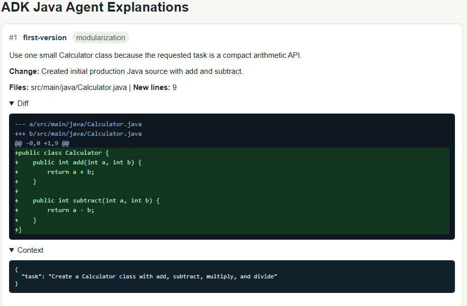
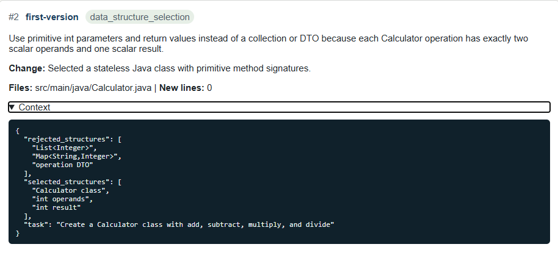
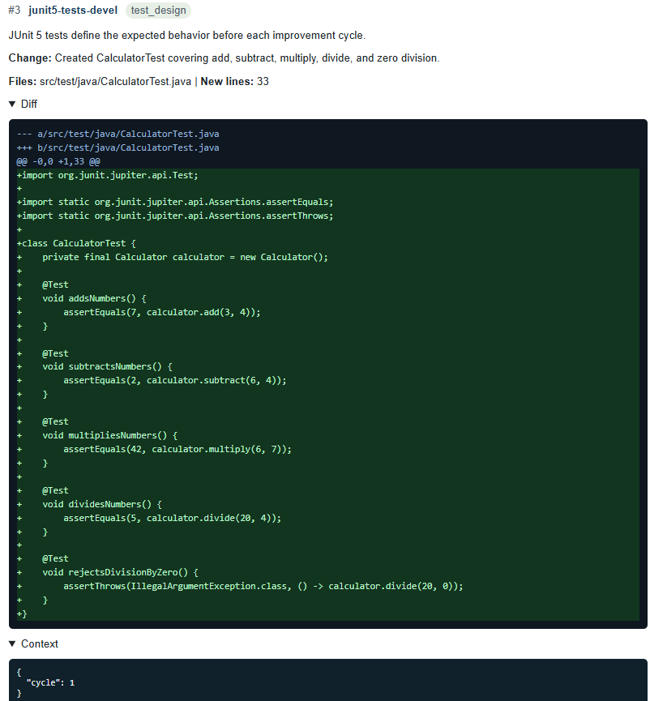
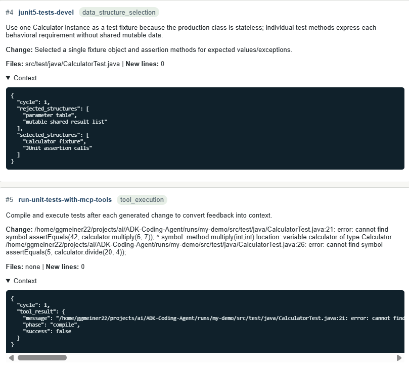
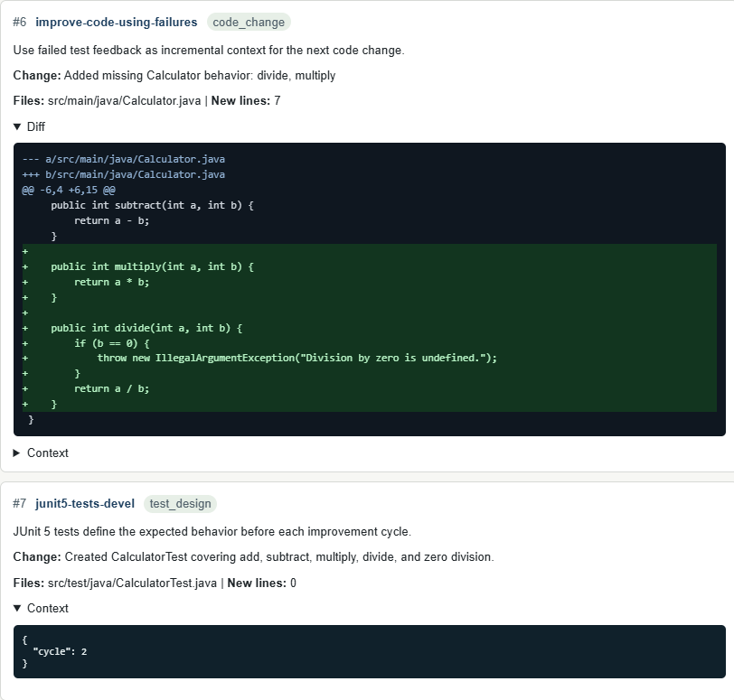
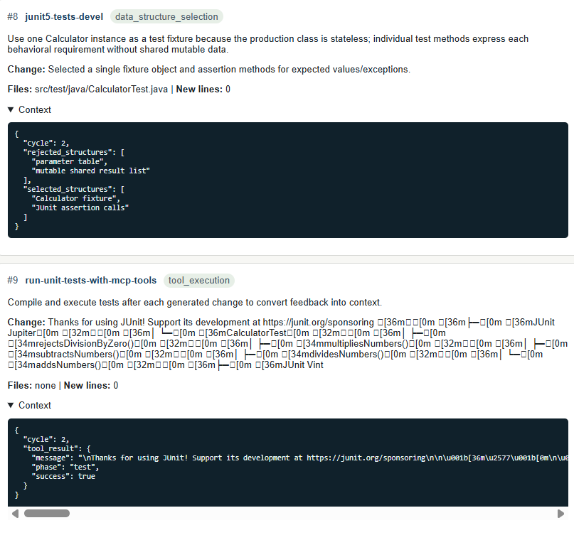

# ADK Java Coding Agent

This folder contains a small ADK-style coding agent that generates a Java
program, creates JUnit 5 tests, runs real Java/JUnit tools, improves the code
from failures, and records explanations in SQLite.

The implemented agent structure is:

```text
SequentialAgent(
  LlmAgent(first version),
  LoopAgent(max_cycles=20, [
    LlmAgent(JUnit5 unit-test development),
    LlmAgent(run unit tests with tools),
    LlmAgent(improve code using failures),
    CheckResultAndEscalate
  ])
)
```

The explanation database records modularization decisions, data structure
choices, code-change reasons, files changed, new-line counts, compiler errors,
test results, and unified diffs for file changes.

## Requirements

Run these commands from **Command Prompt**.

You need:

- `python3`
- `java` and `javac`
- The included JUnit jar:
> tools\junit-platform-console-standalone-1.10.2.jar


## Execution

```bash
python3 -m adk_java_agent.cli \
  --project-root runs/my-demo \
  --junit-jar tools/junit-platform-console-standalone-1.10.2.jar \
  --task "Create a Calculator class with add, subtract, multiply, and divide"
```

Expected output:

```text
All tests passed.
success=True
project_root=.../runs/my-demo
explanations_db=.../runs/my-demo/explanations.sqlite
```

The generated Java files will be in:

```text
runs\my-demo\src\main\java\Calculator.java
runs\my-demo\src\test\java\CalculatorTest.java
```

The explanation database will be:

```text
runs\my-demo\explanations.sqlite
```

## 3. Browse the Explanation Database

Start the web viewer:

```bash
python3 -m adk_java_agent.web \
  --db runs/my-demo/explanations.sqlite \
  --port 8765

```

Then open this address in a browser:

```text
http://127.0.0.1:8765
```

Leave the Command Prompt window open while using the browser. Press `Ctrl+C` in
that window to stop the web viewer.

## Optional: Run Without Java

This mode uses the built-in simulated test tool. It is useful if Java is not
available, but the real Java/JUnit command above is preferred.

```bash
python3 -m adk_java_agent.cli --simulate-tools --project-root runs/local-demo --task \"Create a Calculator class with add, subtract, multiply, and divide\""
```

## Clean Generated Runs

The agent creates output under `runs`. To remove generated demos:

```cmd
rmdir /s /q runs
```

Do not delete `adk_java_agent` or `tools`; those are required to run the program.

## Contex Demo





